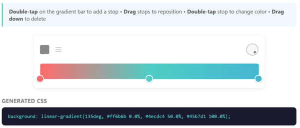
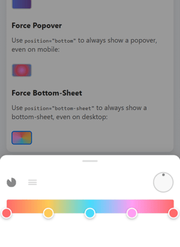

#  ngx-gradient-picker

A modern Angular gradient picker component with draggable color stops, circular angle picker, and full two-way binding support.

[](https://www.npmjs.com/package/ngx-gradient-picker)
[](https://opensource.org/licenses/MIT)
[](https://angular.io/)
[](https://bundlephobia.com/package/ngx-gradient-picker)
[](https://github.com/MikhaelGerbet/ngx-gradient-picker/actions/workflows/ci.yml)

**[📺 Live Demo](https://mikhaelgerbet.github.io/ngx-gradient-picker/)**

<p align="center">
  
</p>

<p align="center">
  <em>Desktop popover mode</em>
</p>

<p align="center">
  
</p>

<p align="center">
  <em>Mobile bottom-sheet mode (auto-detected)</em>
</p>

## ✨ Features

-  **Draggable color stops** with smooth animations
-  **Click to add** new stops on the gradient bar
-  **Drag down to delete** stops
-  **Double-click** to open native color picker
-  **Single stop = solid color** - one stop automatically becomes a solid color
-  **Circular angle picker** for linear gradients
-  **6 gradient types**: Linear, Radial, Conic, Repeating-Linear, Repeating-Radial, Repeating-Conic
-  **CSS parsing** - auto-detect gradient type, angle, and stops from CSS
-  **Mobile-friendly** - bottom-sheet mode for popover, touch-optimized
-  **Angular Signals** for optimal performance
-  **Standalone components** - no module needed
-  **Two-way binding** with `[(palette)]`, `[(angle)]`, `[(type)]`
-  **Works with Reactive Forms**
-  **Fully customizable** dimensions and CSS
-  **🚫 Zero external dependencies** - only Angular core

##  Installation

```bash
npm install ngx-gradient-picker
```

or with yarn:

```bash
yarn add ngx-gradient-picker
```

or with pnpm:

```bash
pnpm add ngx-gradient-picker
```

##  Quick Start

### Basic Usage

```typescript
import { Component, signal } from '@angular/core';
import { GradientPickerComponent, ColorStop, createColorStop } from 'ngx-gradient-picker';

@Component({
  selector: 'app-example',
  standalone: true,
  imports: [GradientPickerComponent],
  template: `
    <ngx-gradient-picker
      [(palette)]="palette"
      [(angle)]="angle"
      [(type)]="type"
      [width]="350"
      [paletteHeight]="32"/>
  `
})
export class ExampleComponent {
  palette = signal<ColorStop[]>([
    createColorStop(0, '#ff6b6b'),
    createColorStop(0.5, '#4ecdc4'),
    createColorStop(1, '#45b7d1')
  ]);
  angle = signal(90);
  type = signal<GradientType>('linear');
}
```

### GradientType

```typescript
type GradientType = 
  | 'linear' 
  | 'radial' 
  | 'conic'
  | 'repeating-linear'
  | 'repeating-radial'
  | 'repeating-conic';
```

### Popover Mode

Perfect for forms and compact UIs. **By default, the picker automatically adapts to the device**:

```typescript
import { GradientPickerPopoverComponent } from 'ngx-gradient-picker';

@Component({
  imports: [GradientPickerPopoverComponent],
  template: `
    <!-- Auto mode (default): mobile = bottom-sheet, desktop = popover -->
    <ngx-gradient-picker-popover
      [(palette)]="palette"
      [(angle)]="angle"/>
  `
})
```

### Position Options

| Position | Behavior |
|----------|----------|
| `'auto'` (default) | **Auto-detects device**: mobile/touch → bottom-sheet, desktop → popover |
| `'bottom'` / `'top'` / `'left'` / `'right'` | Force popover at specified position |
| `'bottom-sheet'` | Force bottom-sheet mode (full-width modal) |

```html
<!-- Force popover mode even on mobile -->
<ngx-gradient-picker-popover [position]="'bottom'"/>

<!-- Force bottom-sheet even on desktop -->
<ngx-gradient-picker-popover [position]="'bottom-sheet'"/>
```

### CSS Auto-Detection

Parse any CSS gradient string and extract its type, angle, and color stops:

```typescript
import { parseGradientCSS } from 'ngx-gradient-picker';

const css = 'linear-gradient(135deg, #667eea 0%, #764ba2 100%)';
const config = parseGradientCSS(css);
// config = { type: 'linear', angle: 135, stops: [...] }

// Then apply to your picker:
palette.set(config.stops);
angle.set(config.angle);
type.set(config.type);
```

### Get CSS Output

```typescript
import { Component, viewChild } from '@angular/core';
import { GradientPickerComponent, paletteToCSS } from 'ngx-gradient-picker';

@Component({
  template: `
    <ngx-gradient-picker #picker [(palette)]="palette" [(angle)]="angle"/>
    <div [style.background]="gradientCSS">Preview</div>
  `
})
export class ExampleComponent {
  picker = viewChild<GradientPickerComponent>('picker');
  
  // Option 1: Use the component method
  get gradientCSS() {
    return this.picker()?.getGradientCSS() ?? '';
  }
  
  // Option 2: Use the utility function
  get gradientCSS2() {
    return paletteToCSS(this.palette(), this.angle(), 'linear');
  }
}
```

##  With Reactive Forms

The component implements `ControlValueAccessor`, so it works directly with Angular forms:

```typescript
import { Component, signal, inject } from '@angular/core';
import { FormBuilder, ReactiveFormsModule } from '@angular/forms';
import { GradientPickerComponent, ColorStop, createColorStop } from 'ngx-gradient-picker';

@Component({
  standalone: true,
  imports: [ReactiveFormsModule, GradientPickerComponent],
  template: `
    <form [formGroup]="form">
      <!-- formControlName binds the CSS output directly -->
      <ngx-gradient-picker
        formControlName="gradient"
        [(palette)]="palette"
        [(angle)]="angle"/>
      
      <div [style.background]="form.get('gradient')?.value">
        Preview
      </div>
    </form>
  `
})
export class FormComponent {
  private fb = inject(FormBuilder);
  
  palette = signal<ColorStop[]>([
    createColorStop(0, '#667eea'),
    createColorStop(1, '#764ba2')
  ]);
  angle = signal(90);
  
  // The CSS string is automatically synced to the form control
  form = this.fb.group({
    gradient: ['']
  });
}
```

##  API Reference

### GradientPickerComponent

The component implements `ControlValueAccessor` - the form value is the CSS gradient string.

| Input/Output | Type | Default | Description |
|--------------|------|---------|-------------|
| `[(palette)]` | `ColorStop[]` | `[]` | Two-way binding for color stops |
| `[(angle)]` | `number` | `90` | Gradient angle (0-360 deg) |
| `[(type)]` | `GradientType` | `'linear'` | Gradient type (see types above) |
| `[width]` | `number` | `300` | Picker width in pixels |
| `[paletteHeight]` | `number` | `24` | Gradient bar height |
| `[minStops]` | `number` | `1` | Minimum color stops (1 allows solid colors) |
| `[maxStops]` | `number` | `50` | Maximum color stops |
| `(stopSelect)` | `EventEmitter<ColorStop>` | - | Emitted when a stop is selected |
| `formControlName` | `string` | - | Binds CSS output to form control |

### GradientPickerPopoverComponent

| Input/Output | Type | Default | Description |
|--------------|------|---------|-------------|
| `[(palette)]` | `ColorStop[]` | `[]` | Two-way binding for color stops |
| `[(angle)]` | `number` | `90` | Gradient angle |
| `[width]` | `number` | `300` | Picker width |
| `[position]` | `PopoverPosition` | `'auto'` | Position mode (see table above) |

```typescript
type PopoverPosition = 'top' | 'bottom' | 'left' | 'right' | 'bottom-sheet' | 'auto';
```

### ColorStop Interface

```typescript
interface ColorStop {
  id: string;       // Unique identifier
  offset: number;   // Position (0 to 1)
  color: string;    // Hex color value (#rrggbb)
  opacity?: number; // Optional opacity (0 to 1)
}
```

### Helper Functions

```typescript
import { 
  createColorStop, 
  paletteToCSS,
  parseGradientCSS,
  generateStopId,
  sortStopsByOffset,
  generateGradientCSS
} from 'ngx-gradient-picker';

// Create a new color stop
const stop = createColorStop(0.5, '#ff0000');
// { id: 'stop-xxx', offset: 0.5, color: '#ff0000', opacity: 1 }

// Generate CSS from palette
const css = paletteToCSS(palette, 90, 'linear');
// 'linear-gradient(90deg, #ff0000 0%, #00ff00 100%)'

// Parse CSS to get gradient config (auto-detection)
const config = parseGradientCSS('linear-gradient(45deg, #ff6b6b 0%, #4ecdc4 100%)');
// { type: 'linear', angle: 45, stops: [...] }
```

## 🎨 Solid Color Support

When only **one color stop** is present, the picker automatically outputs a **solid color** instead of a gradient:

```typescript
// Single stop = solid color output
const palette = [createColorStop(0, '#ff6b6b')];
const css = paletteToCSS(palette, 90, 'linear');
// Returns: '#ff6b6b' (not 'linear-gradient(...)')
```

This is enabled by default (`minStops="1"`). To enforce at least 2 stops (gradient only), set `minStops` to `2`:

```html
<ngx-gradient-picker
  [(palette)]="palette"
  [minStops]="2" />
```

##  User Interactions

| Action | Effect |
|--------|--------|
| **Click** on gradient bar | Add new color stop |
| **Drag** a stop horizontally | Reposition the stop |
| **Drag** a stop down | Delete the stop (if > minStops) |
| **Double-click** a stop | Open native color picker |
| **Drag** angle picker | Change gradient angle |
| **Click** type button | Cycle between linear/radial/conic |
| **Click** repeat button | Toggle repeating mode |

## 🎨 CSS Customization

Override these CSS classes to customize the appearance:

| Class | Description |
|-------|-------------|
| `.gradient-picker-container` | Main wrapper with background, padding, border-radius |
| `.gradient-picker-header` | Header containing type picker and angle picker |
| `.gradient-picker-body` | Body containing palette and color stops |
| `.color-stop-marker` | The circular color stop marker |
| `.palette-svg` | The gradient preview bar |
| `.angle-picker-container` | Container for the angle dial |
| `.dial` | The circular dial element |
| `.type-picker-container` | Container for type toggle buttons |
| `.type-toggle` | Type toggle button (linear/radial/conic) |
| `.repeat-toggle` | Repeat mode toggle button |
| `.popover-trigger` | The button that opens the popover |
| `.popover-content` | The popover container |
| `.popover-backdrop` | Backdrop overlay (bottom-sheet mode) |

Example customization:

```scss
::ng-deep .gradient-picker-container {
  background: #1a1a2e;
  border-radius: 16px;
  box-shadow: 0 8px 32px rgba(0, 0, 0, 0.3);
}

::ng-deep .color-stop-marker {
  width: 20px;
  height: 20px;
  border-width: 3px;
}
```

##  Angular Compatibility

| ngx-gradient-picker | Angular |
|---------------------|---------|
| 1.x | 17.x, 18.x, 19.x, 20.x |

## 📦 Bundle Size

| Metric | Size |
|--------|------|
| FESM Bundle (unminified) | ~99 KB |
| Gzipped (estimated) | ~16 KB |

> **Note on npm publishing best practices**: Angular libraries are published **unminified** to npm. This is intentional because:
> - The consuming application's bundler (webpack, esbuild, vite) handles tree-shaking to remove unused code
> - The bundler's minifier optimizes all code together for better compression
> - Source maps remain accurate for debugging
> - Consumer build tools can apply their own optimizations
>
> The final impact on your app will depend on which components you import and your bundler's optimization settings.

##  Demo

**[📺 Try the live demo](https://mikhaelgerbet.github.io/ngx-gradient-picker/)**

##  Contributing

Contributions are welcome! Please read our [Contributing Guide](CONTRIBUTING.md) for details on:
- How to submit bug reports and feature requests
- How to set up the development environment
- Code style guidelines
- Pull request process

##  License

MIT © [Mikhaël GERBET](https://github.com/MikhaelGerbet)
